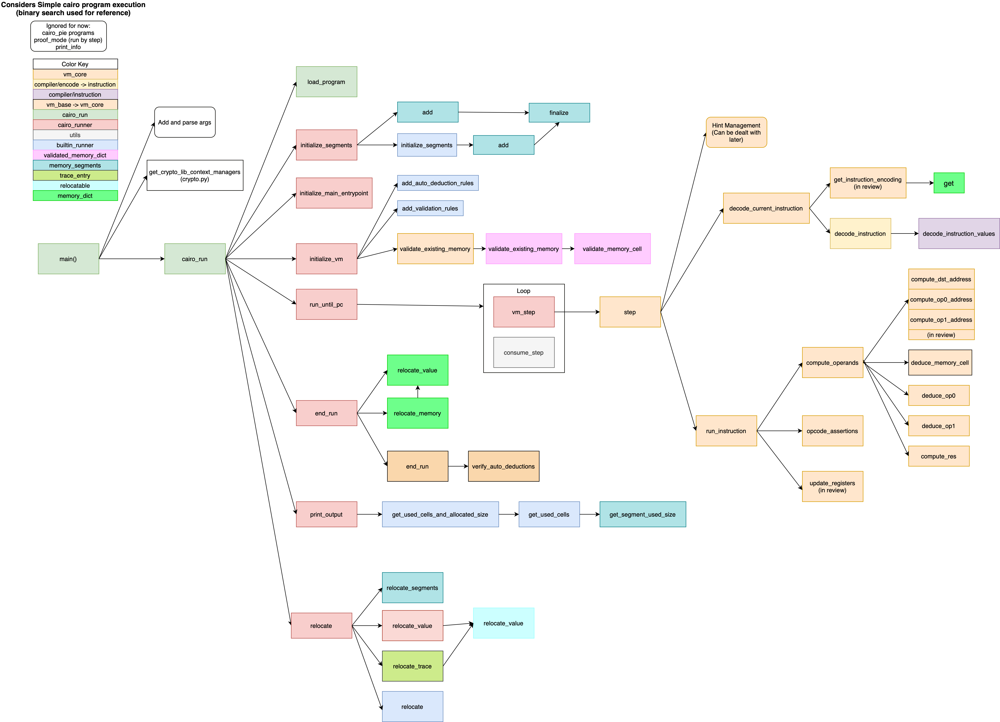

# Cleopatra

Rust implementation of the Cairo VM

## Must Read

* From Cairo Documentation: [How Cairo Works](https://www.cairo-lang.org/docs/how_cairo_works/index.html#how-cairo-works)

* [Cairo VM code](https://github.com/starkware-libs/cairo-lang/tree/master/src/starkware/cairo/lang/vm)

## Complementary Reading

* [Cairo Whitepaper](https://eprint.iacr.org/2021/1063)

## Flux Diagram

We've created a diagram that illustrates function calls and where each of them are defined for a simple cairo program execution.



# How does the original Cairo VM work?

## How does the vm manage memory?


Cairo's memory is read-only (can only be written once), and requires that memory adresses accessed by the program must be continuous. If gaps are present they will be filled with arbitrary values.

The memory itself is a list of continuous segments, the size of each segment may vary and can only be known once the program terminates. Absolute adresses of every memory cell within a segment can only be determined at the end of a vm run (Relocatable values are used to represent them, indicating the segment number and the offset).

The different segments:
* Program Segment: Contains cairo bytecode. pc starts at the beginning of this segment
* Execution Segment: Where data is generated during the run of a Cairo program. Lenght is variable(depends on program input). Allocation Pointer (ap) and Frame Pointer (fp) start here.
* Builtin Segment: Each builtin has its own continuous area in memory. Length is variable


## Registers

**Allocation Pointer (ap)** Points to a yet unused memory cell.
**Frame Pointer (fp)** Points to the frame of the current function. The addresses of all the function's arguments and local variables are relative to the value of this register. It's equal to ap when the function starts, and remains constant throughout the scope of it. When a function2 is called inside a function1, the value of fp changes once function2 starts, but it is restored back to function1's value once function2 ends (this is needed to keep track of function1's value, as ap will have changed).
**Program Counter (pc)** Points to the current instruction. Each instruction takes 1 or 2 felts(2 when an imm is used), and pc advances by 1 or 2 after each instruction, other ways of changing this register is by jumps.

Imm (Immediate) is: 
The second value of an operand (such as 5 in [ap -1] = [fp + 10] + 5)
The standalone value for assignements (such as 5 in [fp + 2] = 5)

Jumps:
* Absolute: changes pc to given value (pc = n)
* Relative: advances pc by a given value (pc + n)
* Jump to label: relative jump, value is computed by the compiler

Other info:

let creates a reference
tempvar is based on ap
local is based on fp
alloc_locals = ap += SIZE_OF_LOCALS


# Cairo VM Code Analysis

Lets look at how the VM is composed:
The VirtualMachine structure:
* [`run_context`](#context)
* `program` : [ProgramBase](#progbase)
* `program_base` : Optional(MaybeRelocatable)(if none, it is set to run_context.pc)
* `builtin_runners` (Optional Dict or set to {})
* `hint_locals` (Dict)
* `static_locals`(Optional Dict)
VirtualMachineBase's init is used to set these values (plus other ones), the next ones are exclusive to the VirtualMachine:
* `accessed_addresses` (Set that keeps track of memory adresses accessed by cairo instructions)
* `trace` (List of TraceEntry, that each contain the run_context's pc, ap and fp at that moment. A TraceEntry is added after every instruction (Before update_registers is called))
* `current_step` (initialized with 0)
* `skip_instruction_execution` (= False), used by hints to skip execution of current step

Functions:
* `update_registers(instruction, operands):` Updates fp, ap, and pc, based on the instruction's [FpUpdate, ApUpdate and PcUpdate](#updatereg)
* `deduce_op0(instruction, dst, op1) -> Tuple(Op(MaybeRelocatable), Op(MaybeRelocatable) `deduces op0 from op1 and dst, also returns dst as deduced_res in case of an ASSERT_EQ opcode.
* `deduce_op1(instruction, dst, op0) -> Tuple(Op(Mr), Op(Mr))` deduces op1 from op0 and dst, also returns dst as deduced_res in case of an ASSERT_EQ opcode.
* `compute_res(instruction, op0, op1)` -> Optional(MaybeRelocatable): Returns computed res based on instruction.res: returns op1 if OP1, op1+op2 mod prime if ADD, op0 * op1 mod prime if MUL (and both operands are not relocatable), none if UNCONSTRAINED (handled elsewhere???, should be inverse of dst), or fails otherwise
* [`compute_operands(instruction) -> Tuple(Operands, List(int))`](#computeop) -> Returns the Operands(name is plural, its one) based on the Instruction, coputes dst, op0 and op1 adresses, deduces op0 and op1, validates and updates dst, op0, op1.
* Replaceable functions: `is_zero`, `isinstance`, `is_integer_value`
* `decode_instruction(encoded_inst: int, imm : Optional(int))` -> Instruction : calls decode_instruction on compiler/encode.py
* [`decode_current_instruction -> Instruction`](#decodei) : gets instruction at pc
* `opcode_assertion(instruction, Operands)`: Checks the opcodes, and makes sure everything makes sense. Possible opcodes:
    * ASSERT_EQ
    * CALL
    * RET
    * NOP
Doesnt check anything for the last two
* `run_instruction(instruction)`: compute_operands, opcode_assertion, writes pc, ap and fp to trace, updates accessed_adresses, update_registers, and increases the current_step by one
* `step()` disables skip_next_instruction, executes hints, then clears ids and memory(used by hints), skips if skip_next_instruction is enabled, decode_current_instruction, runs the decoded instruction with run_instruction.

This VirtualMachine is built from a VirtualMachineBase

# What is the VirtualMachineBase? (Incomplete Section)
The VirtualMachineBase structure has:
* `run_context` : RunContextBase
* `program` : [ProgramBase](#progbase)
* `hint_locals`: Dict
* `static_locals`: Optional Dict -> if None, it is updated with the values PRIME : self.prime, fadd (a+b mod p), fsub (a - b mod p), fmul (a * b mod p), fdiv (divmod(a,b,p)), fpow (pow(a,b,p)), fis_quad_residue (is_quadratic_residue(a)), fsqrt (sqrt(a,p)), safe_div(safe_div), and to_felt_or_relocatable_value
* `builtin_runners` : Dict
* `program_base`: MaybeRelocatable
* `prime` = program.prime
* `exec_scopes`: List[dict] = [] 
* `hints`:  Dict[MaybeRelocatable, List[CompiledHint]] = {} 
* `hint_pc_and_index` : Dict[int, Tuple[MaybeRelocatable, int]] = {} 
* `instruction_debug_info`: Dict[MaybeRelocatable, InstructionLocation] = {} 
* `debug_file_contents`: Dict[str, str] = {} 
* `error_message_attributes`: List[VmAttributeScope] = [] 
* `validated_memory` = ValidatedMemoryDict(memory=run_context.memory)
* `auto_deduction`: Dict[int, List[Tuple[Rule, tuple]]] = {}

Functions (The ones used by VirtualMachine):
* `exec_hint`(code, globals, hint_index) Executes a hint
* `as_vm_exception` Returns a VmException with additional info
* `deduce_memory_cell(addr)` Tries to deduce value at addr by calling the rules in self.auto_deduction at the addr's segment index with addr

## What is this auto_deduction?

It contains a dictionary that maps a memory index segment to a list of rules (A tuple with the the rule and the args), that will allow the deduction of the vaue of a memory cell within the segment. Rule depends on Protocol, and can be called as a function

<a id="valmem">
    
## What is this validated_memory?
</a>

ValidatedMemoryDict structure:
* `__memory` : MemoryDict
* `__validation_rules` : Dict[int, List[Tuple[ValidationRule, tuple]]] = {} 
* `__validated_adresses` : Set[RelocatableValue]

validated_memory[addr] = `__memory`[addr]

### What are these valdation_rules?

It is a dictionary that maps a segment index to a list of validation rules (a tuple with the rule and the args). A ValidationRule is callable. It behaves the same way a Rule would (despite different definition), it can be used to validate a memory cell by calling `__validate_memory_cell` with the address and the value (from the MemoryDict), or by using `validate_existing_memory` to validate every address in memory.

<a id="progbase">
    
## What is the ProgramBase? 
</a>

This is found at compiler/program.py
The structure contains:
* `prime` : int
* `data` : List[int]
* `builtins`: List[str]
* `main` : Optional(int)

It is the base for `StrippedProgram` and `Program`
The `StrippedProgram` contains minimal information, it doesnt have hints, identifiers, etc. It can be used for verifying reasons. If a program is a `StrippedProgram`, thee is no need to use `load_program` when initializing the vm.

### The Program structure: 
* `prime`: an int that can be serialized as a hex string
* `data` : a list of ints which can be serialized as hex strings
* `hints`: a dictionary that maps ints to a list of `CairoHint`
* `builtins` : a list of strings
* `main_scope` : a `ScopedName` which can be serialized as a string
* `identifiers` : an I`dentifierManager` (serializable)
* `reference_manager` : a `ReferenceManager`
* `attributes` : a list of AttributeScope (serializable)
* `debug_info` : an optional DebugInfo

This class is a marshmellowdataclass, this allows many of its attributes to be serialized
[Marshmellow Documentation](https://marshmallow.readthedocs.io/en/stable/)
    
A `CairoHint` contains a `code` (a string) and accesible_scopes (a list of ScopedName, that can be serialized as strings), and `flow_tracking_data`, a FlowTrackingDataActual.
Where `ScopedName` is a frozen dataclass that contains a path as a string tuple and a SEPARATOR ("."), this should be the path for imports (shuch as starkware.common.serialize). 

A `FlowTrackingDataActual` contains an `ap_tracking` (as a RegTrackingData), a `reference_ids`, as a dictionary that maps reference names (ScopedName) to reference instances (int). A RegTrackingData is used to track the progress of a register during a run. It contains a group (int) which starts at zero and increases by one each time an unknown change happens, and an offset (int) which begins at zero and increases the same way the register does.

An `IdentifierManager` has a `root` (an `IdentifierScope`) and a `dict` ( a MutableMapping between a ScopedName and an IdentifierDefinition).

An `IdentifierScope` contains a `manager` (an IdentifierManager), a `fullname` (a ScopedName), `subscopes`(a dictionary that maps a string to an IdentifierScope), and identifiers (a MutableMapping between a string and an IdentifierDefinition) an IdentifierDefinition can be many kinds of definitions, such as future, alias, const, member, structs, type, label, function, namespace, reference, etc. they all have a TYPE that will contain the name of their type of definition as a ClassVar[str]

A `ReferenceManager` containsa list of `Reference`, and the methods to add a reference and return ist position (`alloc_id`), and to get a reference by its position (`get_ref`)
A `Reference` is a reference to a memory adress for a specific location in the program (This is the reference that is created when you use `let`). It contains`pc` (int), `value` (Expression), `ap_tracking_data` (`RegTrackingData`), `locations` (A list of `Location`, contains a list of definition sites from the reference, it will contain multiple locations when the reference is defined from the convergence of multiple reference definitions), `definition_code_element` (an optional `CodeElement`, the code element that created this reference).

A `Location ` consists of a start_line, start_col, end_line, end_col (ints), and an input_file (file), it indicates the precise location of a reference definition in the source code, and it also contains an optional `parent_location`, when the location points to a reference definition due to a reference expansion. A ParentLocation is a tuple of (location, string).

A `CodeElement` can be any kind of element found in the code (such as hints, function calls, tempvars, locals, references, etc), its structure varies by type, but all of them implement `format` and `get_children`

# Execution flow:


```
step -> decode_instruction
        run instruction   -> compute_operands
                             opcode_assertion
                             adds TraceEntry
                             updates accessed_adresses
                             update_registers
                             increase current step                   
```
<a id="computeop">
    
## How does compute_operands work?
</a>

First it will try to obtain dst, op0 and op1 by computing their adressess (`compute_dst_addr`, `compute_op0_addr`, `compute_op1_addr`), and looking them up in the [validated_memory](#valmem). If op0 and/or op1 can't be obtained this way, they will be deduced, first by calling `deduce_memory_cell` on their previously obtained adresses (At this moment, it is determined wether dst, op0 and op1 will need to be updated on the validated_memory (if they haven't been obtained yet, they will need to be)). If this also fails for one of them, op0 and op1 will be deduced from each other and the dst using `deduce_op0(instructio, dst, op1)` and `deduce_op1(instruction, dst, op0)`. After this, if op1 and/or is yet unobtained, they will be force-pulled from validated_memory to obtain an error message. After op0 and op1 have been handled, the res will be computed (via `compute_res`), if it hasn't been obtained earlier from `deduce_op0` and `deduce_op1`. Then, if dst wasnt obtained at the beggining, it will be assigned based on the instructions Opcode (dst = res if ASSERT_EQ, or dst = run_context.fp if CALL), otherwise it will be force-pulled from validated_memory as with op0 and op1. Afterwards, if dst, op0 and op1 need to be updated, they will be added to the validated_memory, and an Operands is returned with dst, op0, op1, res, + a list with the adresses for dst, op0 and op1.

<a id="decodei">

## How does decode_instruction work?
</a>

This function calls decode_instruction at comiler/encode.py, where `flags`, and the encoded offsets are obtained from calling decode_instruction_values (this function is defined under the Instruction class) on the encoded instruction (an int). This encoded offsets will then become the instruction's offsets after substracting a constant value, and all other values of the Instruction will be determined by "reading" `flags`, by checking specific bits (ie: `flags >> OPCODE_CALL_BIT) & 1` will determine if opcode will be set Instruction.Opcode.CALL).
Some register updates will also be assigned based on the determined opcode: ap_update will be set to ADD2 if the opcode is CALL (ADD2 wont be asigned by reading `flag`, instead, this will be REGULAR), and the fp_update will be determined solely based on the opcode (without using `flag`). `imm` will be set to None unless op1_addr is IMM.

# What is an Operands?
*Yes, a plural name for a class, not confusing at all*

Operands structure:
* `dst`  (MaybeRelocatable)
* `res`  (Op(MaybeRelocatable))
* `op0`  (MaybeRelocatable)
* `op1`  (MaybeRelocatable)

Where MaybeRelocatable is a Union of int and RelocatableValue (can be one or the other, this has to do with how memory is variable till the vm run finishes). And RelocatableValue contains a segment_index and an offset (both ints). 

Operands are computed at the start of each instruction

<a id="context">
    
# What is the run_context?
 </a>
 
RunContext contains:
* `memory`: A MemoryDict -> contains `data`(Dict)   `frozen`(bool) and relocation_rules` (Dict[int, RelocatableValue])
* `pc` : MaybeRelocatable
* `ap` : MaybeRelocatable
* `fp` : MaybeRelocatable
* `prime` : int
Functions:
* `get_instruction_encoding()` -> (encoded_instruction, imm): returns instruction at pc, and the value at pc + 1 if it exists
* `compute_dst_addr(instruction)`: returns either ap or fp depending on the instruction's dst_register + off0 mod prime
* `compute_op0_addr(instruction)`: returns either ap or fp depending on the instruction's op0_register + off1 mod prime
* `compute_op1_addr(instruction)`: returns either fp, ap, or pc depending on the instruction's op1_addr + off2 mod prime
* 
RunContext is built from a RunContextBase, this class has the same structure as RunContext with the function `get_traceback_entries`

# What is a Instruction?
Instruction Structure:
* `off0` : int
* `off1` : int  These offsets are within the range [ -2^15 ][ 2^15 ]
* `off2` : int
* `imm` : Optional(int) (Immediate)
* `dst_register`: Register (Where Register contains AP and FP)
* `op0_register`: Register (Where Register contains AP and FP)
* `op1_addr` : Op1Addr(Enum) These are used by `compute_op1_addr`
    * IMM -> means op1_addr should be run_context.pc
    * AP -> means op1_addr should be run_context.ap
    * FP -> means op1_addr should be run_context.fp
    * OP0 -> means op1_addr should be op0 (Optionally received)
* `res`: Res(Enum) These are used by `compute_res`
    * OP1 -> means res should be op1
    * ADD -> means res should be op0 + op1 mod prime
    * MUL -> means res should be op0 + op1 mod prime
    * UNCONSTRAINED -> res = None (Handled elsewhere), Res is UNCONSTRAINED when a Jump to label occurs (Res.JNZ), This is checked when the instruction is decoded
<a id="updatereg"> 
* `pc_update`: PcUpdate(Enum) These are used by `update_register`
    * REGULAR -> means run_context.pc should be += instruction.size
    * JUMP -> means run_context.pc should be = operands.res
    * JUMP_REL -> means run_context.pc should be += operands.res
    * JNZ -> means run_context.pc should be += instruction_size if operands.dst == 0, or += operands.op1 (This would be a Jump to label)
* `ap_update`: ApUpdate(Enum) These are used by `update_register`
    * REGULAR -> no update
    * ADD -> means run_context.ap should be += operand.res
    * ADD1 -> means run_context.ap should be +=1
    * ADD2 -> means run_context.ap should be +=2
* `fp_update`: FpUpdate(Enum) These are used by `update_register`
    * REGULAR -> no update
    * AP_PLUS2 -> means run_context.fp should be .ap + 2
    * DST -> means run_context.fp should be = operands.dst
</a>
* `opcode`: Opcode(Enum)
    * NOP
    * ASSERT_EQ
    * CALL
    * RET

Functions:
* `size()` 2 if it has immediate, 1 if not
* `decode_instruction_values(encoded_instruction)` returns tuple with flags, off0, off1, off2

These values will then be used by decode_instruction (at compiler/encode).`flag` will be used to determine the enums of the Instruction (Some register updates will be then changed based on the Opcode). off0, off1 and off2 will become the instruction's off0, off1 and off2 after substracting a constant offset value.
