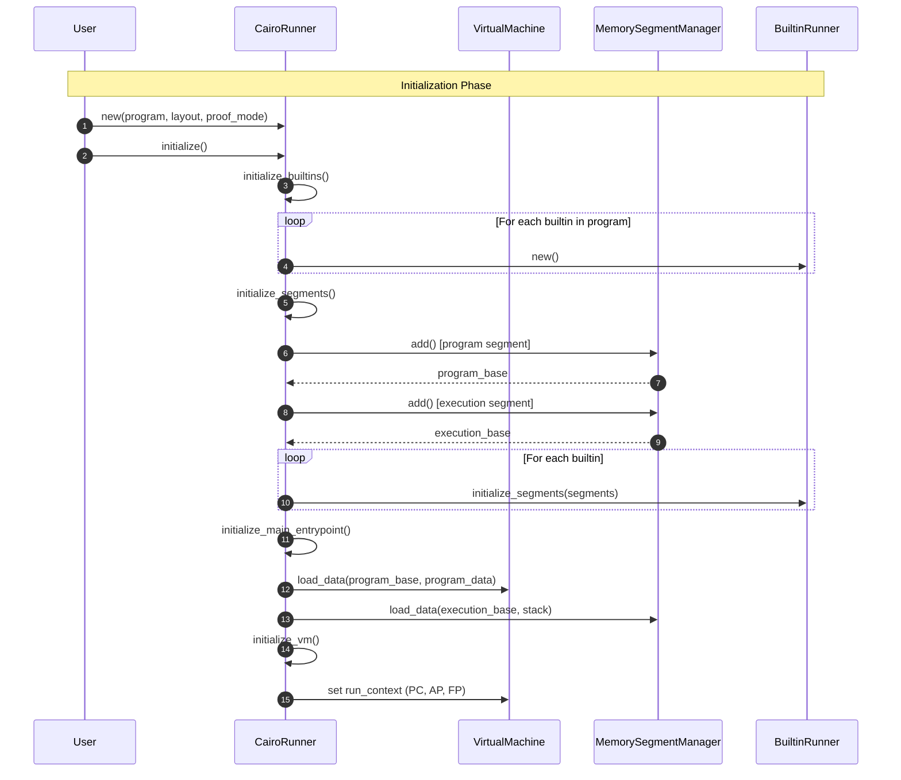
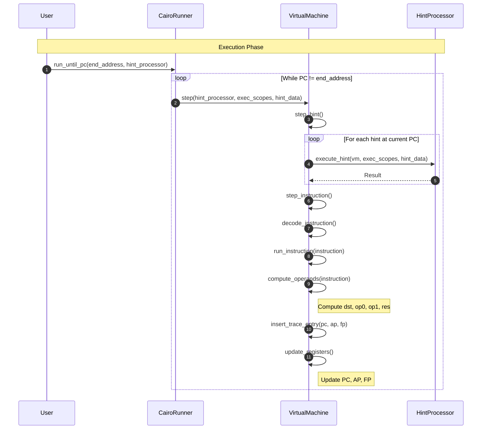
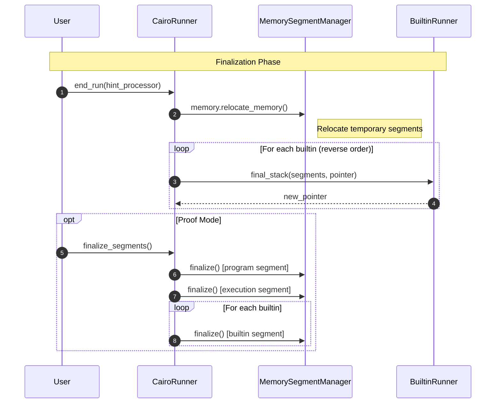
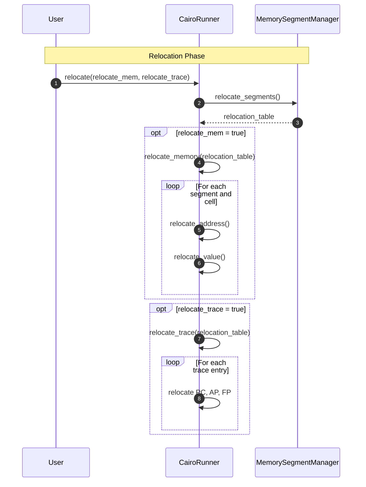

# Program Execution Sequence

A sequence diagram showing the main interactions during Cairo program execution, along with explanations of each phase. It shows the flow of execution of the most important parts, without getting into too much detail about them.

## 1. Initialization Phase

The initialization phase prepares the VM for execution by setting up memory segments and loading the program.

#### `CairoRunner::new()`
Creates a new CairoRunner instance with the specified program, layout, and execution mode (normal or proof mode). Internally creates a new `VirtualMachine` with trace configuration.

#### `initialize()`
Orchestrates the complete initialization sequence:

1. **`initialize_builtins()`** - Creates builtin runners (Range Check, Pedersen, ECDSA, etc.) based on the program requirements and selected layout.

2. **`initialize_segments()`** - Sets up the memory structure:
   - Creates the **program segment** (index 0) to hold bytecode
   - Creates the **execution segment** (index 1) for runtime data
   - Each builtin initializes its own segment(s)

3. **`initialize_main_entrypoint()`** - Prepares the entry point:
   - Collects initial stack values from all builtins
   - Calls `initialize_state()` to load program data into memory
   - Sets `initial_pc`, `initial_ap`, `initial_fp`
   - Returns the `end_address` where execution should stop

4. **`initialize_vm()`** - Configures VM state:
   - Sets `run_context` with PC, AP, FP values

---

## 2. Execution Phase

The execution phase runs the Cairo program instruction by instruction until the program counter reaches the end address.

#### `run_until_pc()`
Main execution loop that continues until `vm.pc == end_address`:

#### `VirtualMachine::step()`
Executes a single step, consisting of:

1. **`step_hint()`** - Executes any hints associated with the current PC:
   - Called via `hint_processor.execute_hint()`

2. **`step_instruction()`** - Executes the current instruction:
   - **Decode**: Fetches instruction from program segment
   - **Compute operands**: Calculates `dst`, `op0`, `op1`, `res`
   - **Insert trace entry**: Records current PC, AP, FP
   - **Update registers**: Modifies PC, AP, FP according to the     executed instruction

---

## 3. Finalization Phase

The finalization phase prepares the execution results for output and optional proving.

#### `end_run()`
Signals that execution is complete:

1. Relocates temporary memory segments into real memory
2. Calls `vm.end_run()` to verify auto-deductions and mark execution finished
3. Computes effective sizes of all segments
4. In proof mode: pads the trace to the next power of 2 (required by the prover)

---

## 4. Relocation Phase

The relocation phase transforms the segmented memory model into a contiguous linear address space.

#### `relocate()`
Starts the process of relocation:

2. **`relocate_segments()`** - Creates the relocation table:
   - Maps each segment index to its base address in linear memory
   - Segment 0 starts at address 1 (address 0 is reserved)
   - Each subsequent segment starts after the previous one ends

3. **`relocate_memory()`** (optional) - Converts all memory cells:
   - Transforms `Relocatable(segment, offset)` addresses to linear integers
   - Stores results in `relocated_memory: Vec<Option<Felt252>>`

4. **`relocate_trace()`** (optional) - Converts trace entries:
   - Relocates PC using the relocation table
   - Relocates AP and FP relative to segment 1 (execution segment)

---

## Key Components

| Component | Responsibility |
|-----------|---------------|
| **CairoRunner** | Responsible of the entire execution lifecycle, manages program and execution state |
| **VirtualMachine** | Executes instructions, manages registers (PC, AP, FP), maintains trace |
| **MemorySegmentManager** | Manages memory segments, handles allocation and relocation |
| **HintProcessor** | Executes hints (non-proven computation), provides external data |
| **BuiltinRunner** | Provides optimized implementations for specific operations (hash, signature, etc.) |

## Memory Layout

- **Segment 0**: Program segment. Contains the instructions of the program
- **Segment 1**: Execution segment. Contains the values produced during execution of the program
- **Segment 2 to N**: Builtin segments. One segment per active builtin, where each segment contains values created by the builtin runnners
- **Segment >N**: User segments. Contains the data structures created by the user

After relocation, all segments are merged into a contiguous memory starting at address 1.
